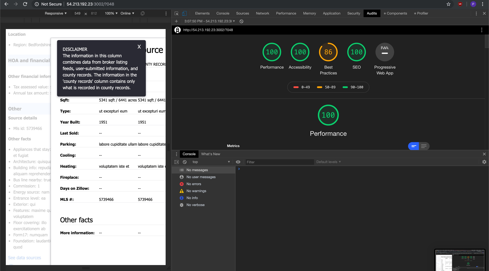

# Zillot Fact & Features

> Facts & Features module for an open source real estate listing item page

## ScreenShots



## Usage

```bash
# Install dependencies
$ npm install

# Build Webpack
$ npm run build

# Seed Mongodb
$ npm run db-setup

# Run the app
$ npm start
```

## Requirements

- [npm](http://npmjs.com)
- [Node.js](https://nodejs.org/en/download/)
- [Git](https://git-scm.com)